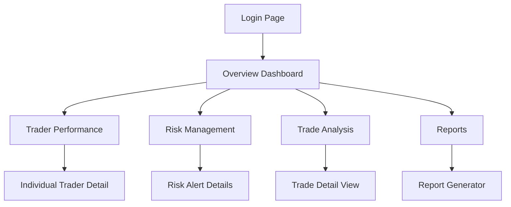

## 1. Product Overview
A comprehensive analysis dashboard for proprietary trading firms to monitor trader performance, manage risk exposure, and analyze trading activities in real-time. This dashboard helps prop firm managers make data-driven decisions about trader funding, risk limits, and overall firm performance.

The dashboard solves the critical need for centralized monitoring of multiple traders' activities, risk metrics, and profitability across different trading strategies and markets. It enables prop firm operators to identify top-performing traders, manage risk exposure, and optimize capital allocation.

## 2. Core Features

### 2.1 User Roles
| Role | Registration Method | Core Permissions |
|------|---------------------|------------------|
| Firm Manager | Admin invitation | Full dashboard access, trader management, risk settings |
| Risk Manager | Admin invitation | View all trader data, modify risk parameters, generate reports |
| Trader | Email registration | View own performance metrics, trading history, risk status |
| Analyst | Admin invitation | View aggregated data, generate reports, no modification rights |

### 2.2 Feature Module
Our prop firm analysis dashboard consists of the following main pages:
1. **Overview Dashboard**: Real-time firm metrics, top traders, risk alerts, P&L summary.
2. **Trader Performance**: Individual trader statistics, profit/loss tracking, win rates, drawdown analysis.
3. **Risk Management**: Live risk monitoring, exposure limits, margin usage, stop-loss tracking.
4. **Trade Analysis**: Detailed trade history, strategy performance, market correlation analysis.
5. **Reports**: Performance reports, risk reports, compliance summaries, export functionality.

### 2.3 Page Details
| Page Name | Module Name | Feature description |
|-----------|-------------|---------------------|
| Overview Dashboard | Key Metrics Panel | Display total firm P&L, active traders, total capital, daily/weekly/monthly returns with trend indicators. |
| Overview Dashboard | Top Performers | Show top 5 traders by P&L, win rate, and consistency metrics with quick profile cards. |
| Overview Dashboard | Risk Alerts | Real-time notifications for traders exceeding risk limits, high drawdowns, or margin calls. |
| Overview Dashboard | Quick Actions | Buttons for common tasks like generating reports, adjusting risk limits, viewing detailed analytics. |
| Trader Performance | Trader List | Searchable and filterable list of all traders with basic stats and status indicators. |
| Trader Performance | Performance Charts | Interactive charts showing P&L over time, win/loss ratios, trading frequency, and strategy breakdown. |
| Trader Performance | Drawdown Analysis | Visual representation of maximum drawdown periods, recovery times, and risk-adjusted returns. |
| Trader Performance | Trading History | Detailed log of all trades with filters for date range, instrument, strategy, and profitability. |
| Risk Management | Live Risk Monitor | Real-time display of total exposure, margin usage, VAR calculations, and risk limits across all traders. |
| Risk Management | Individual Risk Profiles | Risk metrics per trader including position sizes, stop-loss levels, and risk-reward ratios. |
| Risk Management | Exposure Limits | Configure and monitor maximum position sizes, daily loss limits, and sector exposure constraints. |
| Risk Management | Alert Configuration | Set up custom risk alerts for different scenarios like high volatility, correlation breaches, or limit violations. |
| Trade Analysis | Trade Explorer | Advanced filtering and search capabilities for trade history with export options. |
| Trade Analysis | Strategy Performance | Analyze profitability of different trading strategies, timeframes, and market conditions. |
| Trade Analysis | Market Correlation | Identify correlations between trader performance and market movements, volatility patterns. |
| Trade Analysis | Execution Quality | Analyze slippage, fill rates, and execution timing to optimize trading infrastructure. |
| Reports | Performance Reports | Generate comprehensive trader and firm performance reports with customizable date ranges and metrics. |
| Reports | Risk Reports | Create risk assessment reports including exposure analysis, stress test results, and compliance metrics. |
| Reports | Compliance Reports | Generate reports for regulatory compliance including trade reporting, risk disclosures, and audit trails. |
| Reports | Export Functionality | Export reports in multiple formats (PDF, Excel, CSV) with customizable templates and branding. |

## 3. Core Process
### Firm Manager Flow
1. Login to dashboard with secure authentication
2. View real-time overview of firm performance and risk metrics
3. Monitor individual trader performance and risk exposure
4. Adjust risk parameters and trading limits as needed
5. Generate performance reports for stakeholders
6. Review and approve funding decisions for traders

### Risk Manager Flow
1. Access risk management dashboard with appropriate permissions
2. Monitor live risk metrics across all trading activities
3. Review and respond to risk alerts and limit breaches
4. Analyze correlation and concentration risks
5. Generate risk reports for compliance and management review

### Trader Flow
1. Login to view personal performance dashboard
2. Monitor own P&L, win rates, and risk metrics
3. Review trading history and performance analytics
4. Check risk limits and current exposure levels
5. Access educational resources and performance feedback

### Page Navigation Flow

## 4. User Interface Design
### 4.1 Design Style
- **Primary Colors**: Deep blue (#1E3A8A) for headers, emerald green (#10B981) for positive metrics, red (#EF4444) for negative metrics
- **Secondary Colors**: Light gray (#F3F4F6) for backgrounds, dark gray (#374151) for text
- **Button Style**: Rounded corners (8px radius), subtle shadows, hover effects with color transitions
- **Font**: Inter for headers and data, Roboto Mono for numerical data and charts
- **Layout Style**: Card-based layout with clear visual hierarchy, top navigation bar with user profile
- **Icons**: Material Design icons for consistency, custom trading-specific icons for unique metrics

### 4.2 Page Design Overview
| Page Name | Module Name | UI Elements |
|-----------|-------------|-------------|
| Overview Dashboard | Key Metrics Panel | Large metric cards with trend arrows, sparkline charts, and percentage changes. Cards arranged in a responsive grid layout. |
| Overview Dashboard | Top Performers | Horizontal card layout with trader avatars, mini P&L charts, and quick stats. Hover effects show additional details. |
| Trader Performance | Performance Charts | Full-width interactive charts with multiple timeframes, zoom functionality, and overlay comparisons. Dark theme for reduced eye strain. |
| Risk Management | Live Risk Monitor | Traffic light system for risk levels, circular progress indicators for limits, and real-time updating gauges. |
| Trade Analysis | Trade Explorer | Data table with advanced filtering, column sorting, and expandable rows for trade details. Export buttons prominently displayed. |
| Reports | Report Generator | Form-based interface with date pickers, metric checkboxes, and preview functionality. Template selection dropdown for different report types. |

### 4.3 Responsiveness
- Desktop-first design approach with responsive breakpoints at 1200px, 768px, and 480px
- Mobile-optimized views for key metrics and alerts with swipe gestures for navigation
- Touch-friendly interface elements with larger tap targets on mobile devices
- Condensed layouts for smaller screens while maintaining data readability

### 4.4 Data Visualization Guidelines
- Use consistent color coding across all charts (green for profit, red for loss, blue for neutral)
- Implement interactive tooltips with detailed information on hover
- Provide multiple chart types (line, bar, candlestick, heatmap) based on data type
- Include zoom and pan functionality for time-series data
- Use animations sparingly to enhance understanding without causing distraction