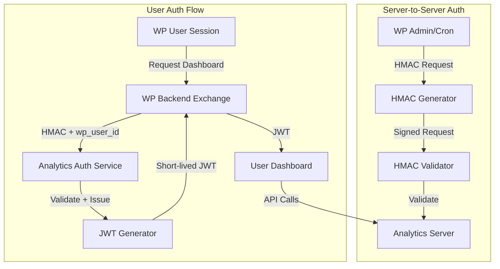
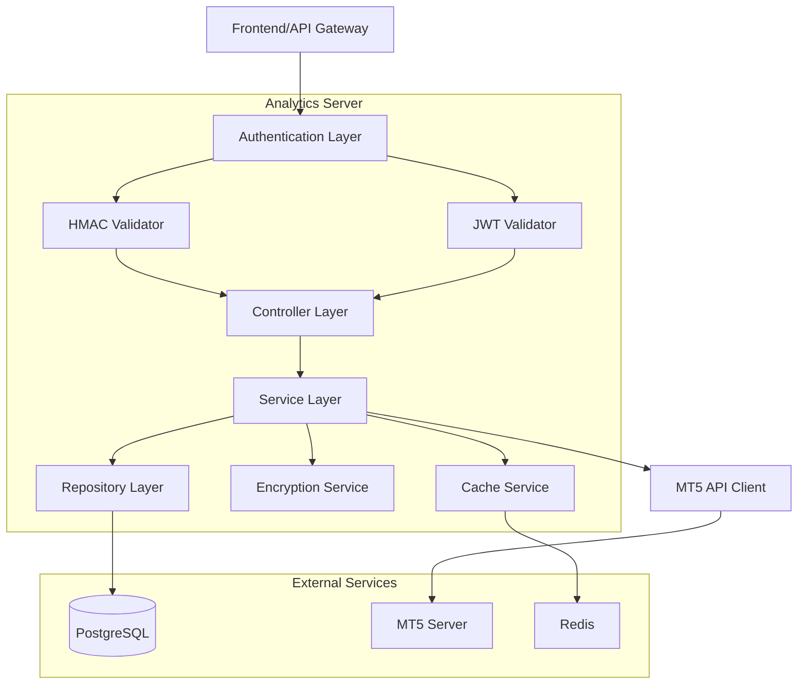
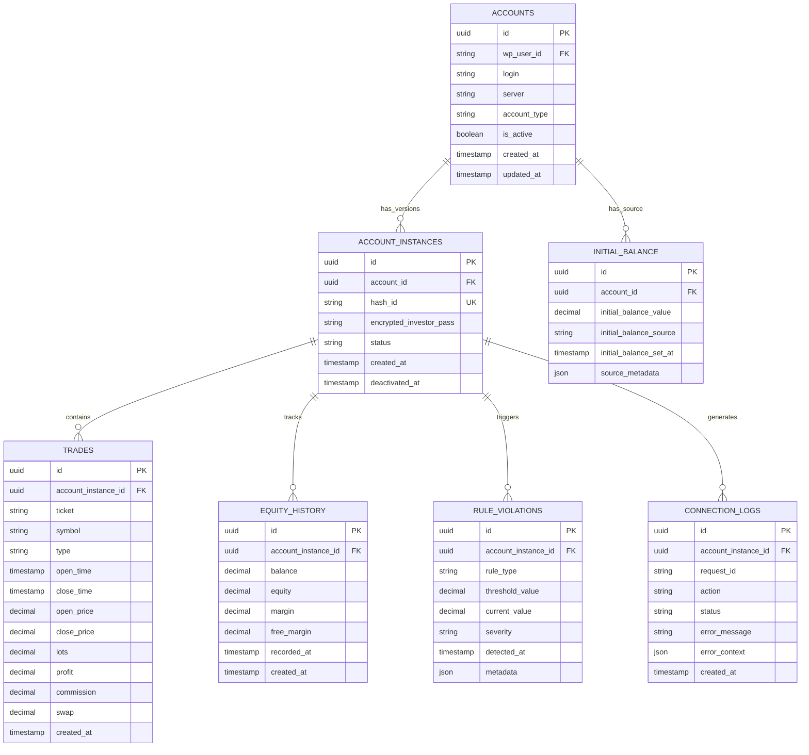

# OneFunders Analyze Dashboard - Technical Architecture (Security-Hardened)

## 1. Architecture Design

### High-Level System Architecture

```mermaid
graph TD
    subgraph "WordPress Layer"
        WP[WordPress + WooCommerce]
        WPP[WP Plugin - Server Side Only]
        WPU[User Dashboard]
        WPM[Order Meta DB]
        WPH[HMAC Service]
    end
    
    subgraph "Analytics Server Layer"
        AS[Analytics Server]
        ASDB[(Analytics DB)]
        MT5API[MT5 API Wrapper]
        ENC[Encryption Service]
        CACHE[Redis Cache]
    end
    
    subgraph "Agent Layer"
        RA[Rule Agent]
        SA[Sync Agent]
    end
    
    subgraph "Frontend Layer"
        AD[Analytics Dashboard]
    end
    
    WP -->|Credentials (one-time)| WPP
    WPP -->|HMAC Signed Request| AS
    WPP -->|Account Data| WPU
    WPM -->|Order Meta| WPP
    WPH -->|Sign Requests| WPP
    
    AS -->|Encrypted Storage| ASDB
    AS -->|Hash Only| ASDB
    AS -->|MT5 Connection| MT5API
    AS -->|Encrypted Creds| ENC
    AS -->|Analytics Data| AD
    AS -->|Cache Layer| CACHE
    
    RA -->|Rule Checks| AS
    SA -->|Adaptive Sync| AS
    
    AD -->|JWT Auth| AS
```

### Authentication Flow Architecture



## 2. Technology Description

### Core Technology Stack

* **Frontend**: React@18 + TypeScript + TailwindCSS@3 + Vite

* **WordPress Plugin**: PHP + WordPress Plugin API + WooCommerce Hooks

* **Analytics Server**: Node.js@18 + Express@4 + TypeScript

* **Database**: PostgreSQL@14 (Supabase)

* **Cache**: Redis@7 (for performance optimization)

* **MT5 Integration**: Custom MT5 API Wrapper (self-hosted)

* **Authentication**: HMAC (Server-to-Server) + Short-lived JWT (User)

* **Encryption**: AES-256-GCM for credential storage

### Initialization Tool

* **Frontend**: vite-init

* **Analytics Server**: npm init with TypeScript configuration

## 3. Route Definitions

### Analytics Dashboard Routes

| Route                 | Purpose                                       |
| --------------------- | --------------------------------------------- |
| /                     | Account selector and overview                 |
| /account/:id          | Main analytics dashboard for specific account |
| /account/:id/trades   | Detailed trade history with pagination        |
| /account/:id/settings | Account settings and preferences              |

### Analytics Server API Routes

| Route                        | Purpose                                      |
| ---------------------------- | -------------------------------------------- |
| POST /api/connect            | Connect to MT5 account (S2S only)          |
| POST /api/auth/exchange      | Exchange WP session for JWT (S2S only)     |
| GET /api/health              | Health check endpoint                        |
| GET /api/metrics             | System metrics (counters, performance)       |
| GET /api/accounts            | List user accounts (JWT auth)              |
| GET /api/account/:id/summary | Get pre-calculated UI metrics (JWT auth)   |
| GET /api/account/:id/trades  | Get paginated trade history (JWT auth)     |
| GET /api/account/:id/equity  | Get current equity data (JWT auth)         |
| POST /api/account/:id/sync   | Trigger manual sync (JWT auth)             |
| GET /api/account/:id/rules   | Get rule violations (JWT auth)             |

### WordPress Plugin Routes

| Route                                        | Purpose                           |
| -------------------------------------------- | --------------------------------- |
| /wp-admin/admin.php?page=onefunders-accounts | Admin account management (S2S)    |
| /wp-admin/admin-ajax.php                     | AJAX endpoints (JWT for users)    |
| /my-account/onefunders-dashboard             | User dashboard page               |

## 4. API Definitions

### Authentication APIs

#### Server-to-Server HMAC Authentication

```
POST /api/connect
```

Headers:
| Header | Type | Required | Description |
|--------|------|----------|-------------|
| X-OneFunders-Signature | string | true | HMAC-SHA256 signature |
| X-OneFunders-Timestamp | string | true | Unix timestamp (±5min) |
| X-OneFunders-Nonce | string | true | Unique request ID |

Request:
| Parameter | Type | Required | Description |
|----------|------|----------|-------------|
| login | string | true | MT5 account login |
| investor_pass | string | true | Investor password (one-time) |
| server | string | true | MT5 server name |
| account_type | string | true | Account plan type |
| wp_user_id | number | true | WordPress user ID |

Response:
| Parameter | Type | Description |
|----------|------|-------------|
| success | boolean | Connection status |
| account_id | string | Internal account ID |
| message | string | Status message |

**Security**: investor_pass is never returned, only used once for connection

#### User JWT Exchange

```
POST /api/auth/exchange
```

Headers: Same HMAC requirements as above

Request:
| Parameter | Type | Required | Description |
|----------|------|----------|-------------|
| wp_user_id | number | true | WordPress user ID |

Response:
| Parameter | Type | Description |
|----------|------|-------------|
| token | string | JWT token (15min expiry) |
| expires_at | string | Token expiration timestamp |

### Dashboard APIs (JWT Auth Required)

#### Pre-calculated Account Summary

```
GET /api/account/:id/summary
```

Response:
| Parameter | Type | Description |
|----------|------|-------------|
| balance_current | number | Current balance |
| equity_current | number | Current equity |
| initial_balance | number | Starting balance |
| balance_change_abs | number | Absolute change vs initial |
| balance_change_pct | number | Percentage change vs initial |
| dd_all_time_used | number | All-time drawdown used |
| dd_all_time_limit | number | All-time drawdown limit |
| dd_all_time_used_pct | number | All-time drawdown percentage |
| dd_daily_used | number | Daily drawdown used |
| dd_daily_limit | number | Daily drawdown limit |
| dd_daily_reset_at | string | Next daily reset timestamp |
| dd_daily_seconds_to_reset | number | Seconds until daily reset |
| trading_days | number | Active trading days |
| win_rate | number | Win percentage |

#### Trade History

```
GET /api/account/:id/trades?page=1&limit=50
```

Response:
| Parameter | Type | Description |
|----------|------|-------------|
| trades | array | Array of trade objects |
| total | number | Total trade count |
| page | number | Current page |
| limit | number | Items per page |

Trade Object:
| Parameter | Type | Description |
|----------|------|-------------|
| ticket | string | Trade ticket ID |
| symbol | string | Trading symbol |
| type | string | BUY/SELL |
| open_time | datetime | Trade open time |
| close_time | datetime | Trade close time |
| open_price | number | Entry price |
| close_price | number | Exit price |
| lots | number | Trade volume |
| profit | number | Trade profit/loss |
| commission | number | Commission paid |
| swap | number | Swap charges |

## 5. Server Architecture

### Analytics Server Layered Architecture



### Service Components

* **Authentication Service**: HMAC validation (S2S) + JWT validation (users)

* **Encryption Service**: AES-256-GCM for credential encryption

* **Account Service**: Manages account instances and lifecycle

* **Data Sync Service**: Adaptive sync with frequency-based heuristics

* **Rule Engine Service**: Tehran timezone daily reset at 01:30 Asia/Tehran

* **Cache Service**: Redis caching with TTL management

## 6. Data Model

### Database Schema



### Data Definition Language

#### Accounts Table

```sql
CREATE TABLE accounts (
    id UUID PRIMARY KEY DEFAULT gen_random_uuid(),
    wp_user_id VARCHAR(50) NOT NULL,
    login VARCHAR(50) NOT NULL,
    server VARCHAR(100) NOT NULL,
    account_type VARCHAR(50) NOT NULL,
    is_active BOOLEAN DEFAULT true,
    created_at TIMESTAMP WITH TIME ZONE DEFAULT NOW(),
    updated_at TIMESTAMP WITH TIME ZONE DEFAULT NOW()
);

CREATE INDEX idx_accounts_wp_user_id ON accounts(wp_user_id);
CREATE INDEX idx_accounts_login_server ON accounts(login, server);
```

#### Account Instances Table

```sql
CREATE TABLE account_instances (
    id UUID PRIMARY KEY DEFAULT gen_random_uuid(),
    account_id UUID NOT NULL REFERENCES accounts(id) ON DELETE CASCADE,
    hash_id VARCHAR(255) UNIQUE NOT NULL,
    encrypted_investor_pass TEXT,
    status VARCHAR(20) DEFAULT 'active' CHECK (status IN ('active', 'deactivated', 'error')),
    created_at TIMESTAMP WITH TIME ZONE DEFAULT NOW(),
    deactivated_at TIMESTAMP WITH TIME ZONE,
    UNIQUE(account_id, hash_id)
);

CREATE INDEX idx_account_instances_account_id ON account_instances(account_id);
CREATE INDEX idx_account_instances_hash_id ON account_instances(hash_id);
CREATE INDEX idx_account_instances_status ON account_instances(status);
```

#### Initial Balance Table

```sql
CREATE TABLE initial_balances (
    id UUID PRIMARY KEY DEFAULT gen_random_uuid(),
    account_id UUID NOT NULL REFERENCES accounts(id) ON DELETE CASCADE,
    initial_balance_value DECIMAL(15,2) NOT NULL,
    initial_balance_source VARCHAR(20) NOT NULL CHECK (initial_balance_source IN ('order_meta', 'mt5_deposits', 'manual')),
    initial_balance_set_at TIMESTAMP WITH TIME ZONE DEFAULT NOW(),
    source_metadata JSONB,
    UNIQUE(account_id)
);

CREATE INDEX idx_initial_balances_account_id ON initial_balances(account_id);
```

#### Trades Table

```sql
CREATE TABLE trades (
    id UUID PRIMARY KEY DEFAULT gen_random_uuid(),
    account_instance_id UUID NOT NULL REFERENCES account_instances(id) ON DELETE CASCADE,
    ticket VARCHAR(50) NOT NULL,
    symbol VARCHAR(20) NOT NULL,
    type VARCHAR(10) NOT NULL CHECK (type IN ('BUY', 'SELL')),
    open_time TIMESTAMP WITH TIME ZONE NOT NULL,
    close_time TIMESTAMP WITH TIME ZONE,
    open_price DECIMAL(15,5) NOT NULL,
    close_price DECIMAL(15,5),
    lots DECIMAL(10,2) NOT NULL,
    profit DECIMAL(15,2) DEFAULT 0,
    commission DECIMAL(15,2) DEFAULT 0,
    swap DECIMAL(15,2) DEFAULT 0,
    created_at TIMESTAMP WITH TIME ZONE DEFAULT NOW(),
    UNIQUE(account_instance_id, ticket)
);

CREATE INDEX idx_trades_account_instance_id ON trades(account_instance_id);
CREATE INDEX idx_trades_open_time ON trades(open_time);
CREATE INDEX idx_trades_close_time ON trades(close_time);
```

#### Equity History Table

```sql
CREATE TABLE equity_history (
    id UUID PRIMARY KEY DEFAULT gen_random_uuid(),
    account_instance_id UUID NOT NULL REFERENCES account_instances(id) ON DELETE CASCADE,
    balance DECIMAL(15,2) NOT NULL,
    equity DECIMAL(15,2) NOT NULL,
    margin DECIMAL(15,2) DEFAULT 0,
    free_margin DECIMAL(15,2) DEFAULT 0,
    recorded_at TIMESTAMP WITH TIME ZONE NOT NULL,
    created_at TIMESTAMP WITH TIME ZONE DEFAULT NOW()
);

CREATE INDEX idx_equity_account_instance_id ON equity_history(account_instance_id);
CREATE INDEX idx_equity_recorded_at ON equity_history(recorded_at);
CREATE INDEX idx_equity_account_time ON equity_history(account_instance_id, recorded_at DESC);
```

#### Rule Violations Table

```sql
CREATE TABLE rule_violations (
    id UUID PRIMARY KEY DEFAULT gen_random_uuid(),
    account_instance_id UUID NOT NULL REFERENCES account_instances(id) ON DELETE CASCADE,
    rule_type VARCHAR(50) NOT NULL,
    threshold_value DECIMAL(15,2) NOT NULL,
    current_value DECIMAL(15,2) NOT NULL,
    severity VARCHAR(20) NOT NULL CHECK (severity IN ('warning', 'critical', 'breach')),
    detected_at TIMESTAMP WITH TIME ZONE DEFAULT NOW(),
    metadata JSONB
);

CREATE INDEX idx_violations_account_instance_id ON rule_violations(account_instance_id);
CREATE INDEX idx_violations_detected_at ON rule_violations(detected_at DESC);
CREATE INDEX idx_violations_rule_type ON rule_violations(rule_type);
```

#### Connection Logs Table

```sql
CREATE TABLE connection_logs (
    id UUID PRIMARY KEY DEFAULT gen_random_uuid(),
    account_instance_id UUID NOT NULL REFERENCES account_instances(id) ON DELETE CASCADE,
    request_id VARCHAR(36) NOT NULL,
    action VARCHAR(50) NOT NULL,
    status VARCHAR(20) NOT NULL,
    error_message TEXT,
    error_context JSONB,
    created_at TIMESTAMP WITH TIME ZONE DEFAULT NOW()
);

CREATE INDEX idx_logs_account_instance_id ON connection_logs(account_instance_id);
CREATE INDEX idx_logs_request_id ON connection_logs(request_id);
CREATE INDEX idx_logs_created_at ON connection_logs(created_at DESC);
```

## 7. Security & Observability

### Security Measures

1. **Credential Handling**:
   - investor_pass: Never stored in plain text
   - Encrypted with AES-256-GCM before storage
   - Encryption keys stored in environment variables
   - Log redaction for all credential fields

2. **Authentication**:
   - Server-to-server: HMAC-SHA256 with timestamp + nonce
   - User sessions: 15-minute JWT tokens
   - No WordPress session validation on analytics server

3. **Access Control**:
   - Admin actions: Server-side only (S2S)
   - User actions: JWT-scoped to specific user
   - Rate limiting on all endpoints

### Observability

1. **Request Tracking**:
   - Unique request_id for every operation
   - Structured JSON logging
   - Error classification and context

2. **Health & Metrics**:
   - `/api/health`: Basic health check
   - `/api/metrics`: Performance counters
   - Circuit breakers for MT5 API failures

3. **Monitoring**:
   - Per-account sync logs
   - Rule violation alerts
   - Connection failure tracking

## 8. Data Ownership & Sync Flow

### Data Ownership Matrix

| Data Type | Owner | Storage Location | Sync Direction |
| --------- | ----- | ---------------- | -------------- |
| User Accounts | WordPress | WP Database | WP → Analytics |
| MT5 Credentials | WordPress | Order Meta | WP → Analytics (one-time, encrypted) |
| Hash IDs | Analytics Server | PostgreSQL | Generated locally |
| Encrypted Credentials | Analytics Server | PostgreSQL | Encrypted storage only |
| Trade Data | Analytics Server | PostgreSQL | MT5 → Analytics |
| Equity Data | Analytics Server | PostgreSQL | MT5 → Analytics |
| Rule Violations | Analytics Server | PostgreSQL | Generated locally |

### Adaptive Sync Strategy

1. **Active Accounts** (has open positions OR last trade < 24h):
   - Sync frequency: 30-60 seconds
   - High priority for rule evaluation

2. **Idle Accounts** (no recent activity):
   - Sync frequency: 10-30 minutes
   - Low priority background processing

3. **Breach-Risk Accounts** (near violation thresholds):
   - Sync frequency: 5-15 seconds
   - Immediate rule evaluation

### Daily Drawdown Reset Logic

**Timezone**: Asia/Tehran (IANA)
**Reset Time**: 01:30 local time daily
**Logic**: Compare current equity against equity at reset time
**Missing Snapshot Handling**: Use nearest snapshot before 01:30 or interpolate

```sql
-- Example: Get daily drawdown baseline
SELECT equity 
FROM equity_history 
WHERE account_instance_id = $1 
  AND recorded_at <= date_trunc('day', NOW() AT TIME ZONE 'Asia/Tehran') + INTERVAL '1 hour 30 minutes'
ORDER BY recorded_at DESC 
LIMIT 1;
```

## 9. MVP Definition (Minimum Lovable Product)

### MVP Must Include

1. **WordPress Plugin**:
   - Admin account list with connection status
   - Manual reconnect functionality
   - HMAC-signed server-to-server communication

2. **User Dashboard**:
   - Account selector
   - Summary metrics (balance/equity/drawdowns with pre-calculated UI fields)
   - Trades table with pagination

3. **Rule Engine**:
   - Daily drawdown (Asia/Tehran timezone, 01:30 reset)
   - Maximum drawdown tracking
   - Floating vs closed-only toggle per plan

### Phase 2 Features

* Real-time WebSocket updates
* Advanced analytics and statistics
* XLSX export functionality
* Adaptive sync optimization
* Comprehensive monitoring and alerting

## 10. Critical Security & Architecture Notes

### Non-Negotiable Security Requirements

1. **investor_pass**: Never returned in API responses, encrypted if stored
2. **Admin Actions**: Must be server-side only, never browser-based
3. **Authentication**: HMAC for S2S, short-lived JWT for users
4. **Logging**: Redact all credentials, include request_id for tracking

### Architecture Decisions

1. **Account Instances**: Handle credential changes and account resets cleanly
2. **Initial Balance**: Store source and method for transparency
3. **Daily Reset**: Use Asia/Tehran timezone with deterministic logic
4. **Sync Strategy**: Adaptive frequency based on account activity

### Performance Targets

* **API Response**: <200ms cached, <2s fresh data
* **Dashboard Load**: <3 seconds full page
* **Sync Latency**: Active accounts <1min, idle accounts <30min
* **Concurrent Users**: 500+ dashboard users